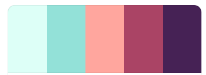
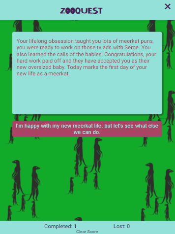

# My game title

## 1 Introduction

***

Live site: [ZOOQUEST](https://hartnetl.github.io/the-sealiest-game-you-will-play-today/)

Project Aim: Use vanilla JavaScript to build a text adventure game

'ZOOQUEST' is a fun text-based adventure game. As a player you will be presented with different scenarios and a couple of ways to respond.   
The story will take you through, as I'm sure you guessed, a day at the zoo. But be warned, while a day at the zoo seems nice and relaxing, danger lurks just around the corner...

1. [Introduction](#1-introduction)
2. [UXD User Experience Design](#2-uxd-user-experience-design)
    - [2.1 Strategy](#21-strategy)
    - [2.2 Scope](#22-scope)
    - [2.3 Structure](#23-structure)
    - [2.4 Skeleton](#24-skeleton)
    - [2.5 Surface](#25-surface)
3. [Features](#3-Features)
    - [3.1 Exisiting](#31-existing-features)
    - [3.2 Future](#32-future-features)
4. [Technologies Used](#4-technologies-and-resources-used)
5. [Testing](#5-testing)
    - [5.1 Validation](#51-validator-tests)
    - [5.2 Accessibility](#52-accessibility-test)
    - [5.3 Performance](#53-performance-test)
    - [5.4 Manual](#54-manual-testing)
6. [Bugs](#6-bugs)
7. [Deployment](#7-deployment)
8. [Credits](#8-credits)
9. [Acknowledgements](#9-acknowledgements)

## 2 UXD User experience Design

***

Text adventure games have become a fairly niche area of gaming, but with the rise in popularity of text based games such as Telltale's Walking Dead there's some hope for this genre yet.  
This game aims to bring nostalgia to those that have played these games in the past, or introduce them to a new generation. The game is easy to play, with a number of ways to gain points for winning and losing and hopefully with that, the incentive to play it over and over until all winning options are found.

### 2.1 Strategy

#### User Goals

Users are looking to play a fun text based adventure game, with replayability and some form of competitiveness.

#### Project goals

By making this game I hope to shine a light on the commonly overlooked genre of text adventure games. It's a different pace for playing a computer game, but a refreshing one in my opinion.
The story takes an ordinary day at the zoo and turns it on its head. I want to capture the player's curiosity and attention to make them want to replay the game and find all the different ways to end the game.

#### User Stories

- Users want to play a game that functions and flows correctly
- Users want a pleasant visual experience, with easy readability
- Users want to be able to keep track of their score
- Users want to be able to easily exit the game
- Users want to be able to reset the game

- The owners want to make the game easy to understand
- The owners want to make sure game isn't too complicated
- The owners want to promote competitiveness to encourage people sharing the game with their friends
- The owners want to make it clear if each ending counts as a win or loss

### 2.2 Scope

The aim of this project was to design a project using vanilla JavaScript. I decided to go ahead with a text based adventure game with mutiple outcomes for the player to discover.

The features to include:

- Pop-up instructions for how to play the game - JS modal
- Option to exit the game - 'x' button when clicked will redirect to main page
- Score tracker - A JS function to increment score
- Clear score option - A JS function to set scores to 0
- Win / lose sound to signal winning and losing options - A JS function to allow sounds to play at appropriate time
- Change background image to match scenario - Use JS to change bakground and main text
- Change background image to emphasize win/loss point - A green/red backgrounf for clarity

### 2.3 Structure

The game will have two pages, with simple styling:
1. landing page
    - Title
    - Play button which brings user to the start of the game
    - How to Play button which brings up a message listing instructions for the game
    - A tally of scores, set to 0 for new users or previous score is player has played the game on that device before

2. game page
    - Title
    - Exit button
    - Text box to display the scenarios
    - Option buttons for user to choose how the story progresses
    - Score tally
    - Clear scores button

### 2.4 Skeleton

The game has a very simple, easy to follow layout. The background changes to match the scenario being displayed.

### 2.5 Surface

#### Aesthetic

The game has a simple layout, with simple styling to match. The backgrounds are tile-designed with repeated images to relate to each scenario.

#### Colours

The game was mostly styled using this colour palette found on [coolers.co](https://coolors.co/ddfff7-93e1d8-ffa69e-aa4465-462255).
It's a fun, warm palette with a nice level of contrast with colours.
The background images did not follow this colour palette. 
These included a light blue / lavendar colour for neutral scenarios, navy for night time scenarios, red for options that result in a losing point and green for options that result in a winning point.
The reason for this change is to relate to the game scenarios, and the red and green background are to emphasize the loss/win for that scenario.

#### Fonts

The title font is 'Kirang Haerang'. It is a fun font that's still easy to read. 
For the main text I chose 'Roboto' as it's an appealing font that's easy to read, and sans-serif fonts are more suitable to people with reading difficulties such as dyslexia.

#### Imagery

The background images were created using [Adobe Spark](https://spark.adobe.com/sp/). 
Each image relates to the scenario, depicting the animal being viewed or the player's fate. Red coloured backgrounds signal a loss has been incurred and the player will be going back to the start. Green coloured backgrounds signal a win has occurred, but the player will still go back to the start to play again.

## 3 Features

***

### 3.1 Existing Features

- Users want to play a game that functions correctly and flows correctly  
    - Feature:  
    The game works
- Users want a pleasant visual experience, with easy readability
    - Feature:  
    Fonts have contrast to background, text box has full opacity, backgrounds are entertaining  
     
      
- Users want to be able to keep track of their score
    - Feature:  
     Score is tracked at bottom of both pages  
     
- Users want to be able to easily exit the game
    - Feature:  
    An x button has been created, which doesn't affect user's score  
    
- Users want to be able to reset the game
    - Feature:   
    Reset button clears the score count  
    
- The owners want to make the game easy to understand
    - Feature:  
    Instructions have been provided for the game  
      
- The owners want to make sure game isn't too complicated
    - Feature:  
    Options are typically limited to 2. Language is easy to understand.  
    
- The owners want to promote competitiveness to encourage people sharing the game with their friends
    - Feature:  
    Scores can be screenshot for comparison (No cheating now ;) )  
    
- The owners want to make it clear if each ending counts as a win or loss
    - Feature:  
    When you win a positive jingle sounds, and the background turns green. Win tally goes up.  
    
    - Feature:  
    When you lose a more negative tone sounds, the background turns red and the lose tally goes up.
    

### 3.2 Future Features

- A mute button to give player the option to play without sounds.
At my current level I couldn't find a way to mute my audio using vanilla Javascript, as the audio is initiataed by the user using JavaScript.
- A contact form to allow users to make suggestions on new scenarios, to allow the game to grow.

## 4 Technologies and Resources Used

***

### Languages

[HTML](https://html.com/): HyperText Markup Language. It is the language used as the basis of building websites and provides the main structure and format to the site.

[CSS](https://www.w3.org/Style/CSS/Overview.en.html): Cascading Style Sheets. It's the language used to make the web elements look better. It adds colour, positioning, fonts etc.

[JavaScript](https://www.w3schools.com/js/): JavaScript is needed to control a web page's behaviour and adds more interaction for the user. 

This project uses vanilla JavaScript, meaning no external frameworks have been used.

### Programmes and Libraries Used

- [Balsamiq](https://balsamiq.com/tutorials/) used to build framework.
- [Chrome devtools](https://developer.chrome.com/docs/devtools/) used for finding quick solutions to design issues and visualising the site on different screen sizes for making media queries.
- [Font Awesome](https://fontawesome.com/) used to source social media icons
- [Git](https://git-scm.com/) used for version control of my site and pushing code to GitHub
- [GitHub](https://github.com/) the cloud storage system for my projects. The location of this site's repository, and place to deploy site.
- [GitPod](https://gitpod.io/) the IDE used to write and preview the code for this website.
- [TinyJPG](https://tinypng.com/) used to compress images used without compromising the quality.
- [Adobe Spark]() used to create the backgrounds.
- [Coolers]() used to pick my colours for the website.
- [Favicon](https://favicon.io/emoji-favicons/giraffe) used to make the favicon in the browser tab of the website.

### Resources for code

I relied heavily on the Love Maths project and lessons provided by the Code Institute. 
Before writing my code I researched different tutorials for creating games, and found [this YouTube tutorial](https://www.youtube.com/watch?v=R1S_NhKkvGA) particularly helpful.
I also referenced [w3schools](https://www.w3schools.com/), [stackoverflow](https://stackoverflow.com/), [MDN web docs](https://developer.mozilla.org) and [code grepper](https://codegrepper.com) for troubleshooting. 

## 5 Testing

***

### 5.1 Validator Tests

- HTML was validated using [W3C markup validator](https://validator.w3.org/).  

    #### index.html     
    - On the first validation there were 2 error types returned.  
    A tags are not allowed in button elements, so these were changed to buttons in form tags to redirect the page.  
    The chrome icons for the favicon had an incompatible rel so this was changed.
    - The most recent validation shows no errors, but two warnings regarding sections that lack headings. Details [here](assets/readme-files/index-html-val.png).  

    #### game.html
    - The first validation of this html file returned the same errors as index.html and the same changes were made.
    - The most recent validation shows no errors, but two warnings regarding sections that lack headings. Details [here](assets/readme-files/game-html-val.png).  

- CSS was validated using [W3C CSS validator](https://jigsaw.w3.org/css-validator/).  
No errors were returned [see here](assets/readme-files/css-val.png) but two warnings were raised [see here](assets/readme-files/css-val-warn.png) about my imported stylesheets - these are for the fonts. 

- JavaScript was validated using [JSHint](https://jshint.com/).   
Configure setting were changed to accept ES6 Javascript features  
    - intro.js first returned minor syntax errors regarding missing or incorrectly placed semi colons. These were fixed and subsequently no errors were returned. Details of latest results [here](assets/readme-files/intro-jshint.png) 
    - script.js first returned minor syntax errors regarding missing or incorrectly placed semi colons. These were fixed and subsequently no errors were returned. Details of latest results [here](assets/readme-files/script-jshint.png) 

### 5.2 Accessibility test

- Accessibility of the site was tested with [WAVE(Web Accessibility Evaluation Tool)](https://wave.webaim.org/).  

### 5.3 Performance test

- Performance was tested with [lighthouse](https://developers.google.com/web/tools/lighthouse/run) and [webpage test](https://www.webpagetest.org/) 

### 5.4 Manual testing

The live link was sent to multiple people for feedback on functionality and design.

- Title logo: Should appear at the top of both pages and on the game page, should redirect to the landing page if clicked.
- Play button: Should bring user to the start of the game.
- How to play button: Should display instructions on screen for how to play the game. A 'x' button allows user to exit the instructions.
- Score tally: Should display 0 if never played before or score was reset, and should display previous score so long as user hasn't cleared cache.
- Exit button: An 'x' button on the game page to bring user back to the landing page. Does not count as a loss.
- Clear scores button: The scores are reset to 0.
- When user clicks an option, the scenario changes to the appropriate follow-up scenario.
- When user clicks a winning option, a happy jingle sounds and win score is incremented by 1.
- When user clicks a losing option, a low buzzer sounds and lose score is incremented by 1.
- Every time an option is picked, the background changes to match the scenario.

## 6 Bugs

***

## Fixed / solved

- After local storage for scores was implemented, the old score would be displayed, but when played through the score would reset instead of adding to it. Fixed by moving oldwin/oldLoss variables.
- When a second HTML and JS file was created, the scores wouldn't display on the home screen. NaN. Function had to be rewritten
- New users don't have a starting score - displays NaN. Needed an if function to check if localStorage existed. Had to do this a couple of times - yay cookies.
- When deployed on Slack peer review channel game wasnt playable - 404 error. Needed to change action location in forms.
- HTML + CSS reset a few steps back.. don't know why

## Still exisiting

## Issues Faced

## 7 Deployment

***

- Sign in to the [GitHub](https://github.com/) website. Go to list of repositories.
- In the github repository section find "the-sealiest-game-you-will-play-today"
- Go to the settings tab located in the menu running across the top of the repository, denoted by a cog icon.
- Click 'Pages' in the navbar on the left.
- Swap source branch from none to master
- Press the save button
- Wait a few minutes while your page is being built.
- A highlighted banner should be displayed on the page saying "Your site is published at <https://hartnetl.github.io/the-sealiest-game-you-will-play-today/> " with a tick icon to the left of it.
- The site is now live.

## 8 Credits

***

### Sounds

winBell.mp3  
<https://freesound.org/people/MattLeschuck/sounds/511484/>  
MattLeschuck  

loseTone.mp3  
<https://freesound.org/people/KevinVG207/sounds/331912/>  
kevinVG207

### Code for things I didn't know how to do

Youtube tutorial  
Build A Text Adventure Game With JavaScript - Web Dev Simplified  
<https://www.codegrepper.com/code-examples/javascript/how+to+play+sounds+vanilla+js>  

Storage function help  
<https://developer.mozilla.org/en-US/docs/Web/API/Storage>  

Modal help  
<https://www.w3schools.com/howto/howto_css_modals.asp>  

Play sounds  
<https://www.codegrepper.com/code-examples/javascript/how+to+play+sounds+vanilla+js>  

## 9 Acknowledgements

A huge thank you to my class tutor Kasia, my mentor Maria and all of the slack community. Your help and support keeps me motivated.    
Thank you to the staff at Tutor Support who are amazingly helpful at prodding me in the right direction when I hit a wall.  
And a massive shoutout to everyone who was subjected to testing this game, especially those who played it numerous times. You're all stars!  
